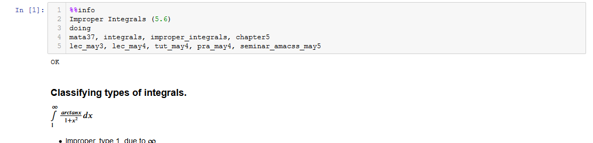
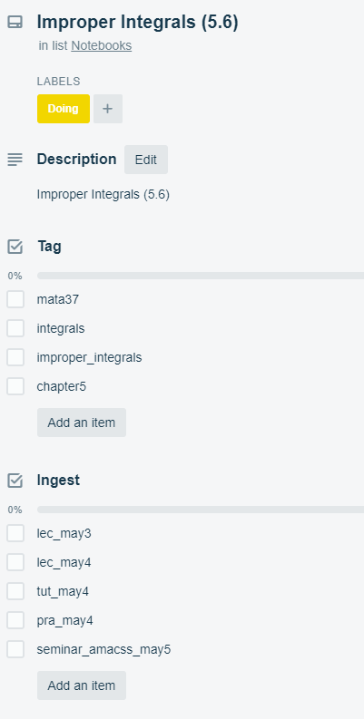

# Note Taking

Useful tools for note taking.

Eventually I'll add some details about my note taking workflow.

## Jupyter Notebook Trello Tool

Add a Trello Card to a Trello board by using the cell magic %%info in the format

```
%%info
Display Name
Status
Tags
Ingest
```

where status is `todo/doing/done` or `1/2/3` respectively and tags/ingest are both csv values.

### Example

In Jupyter Notebook...



Results in...




